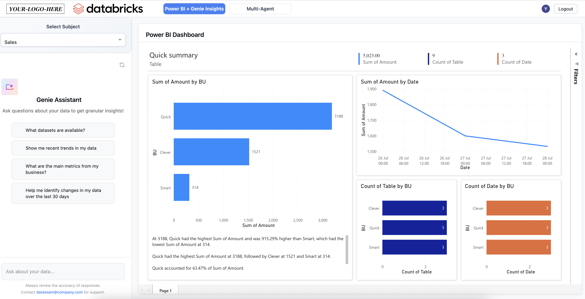

# Power BI Dashboard Assistant with Databricks Genie

> **⚠️ EXPERIMENTAL CODE - NOT FOR PRODUCTION USE**
> 
> This is **experimental code** designed to **accelerate development** of end-user interfaces for AI agents and dashboard visualization. This code is intended for **prototyping, learning, and development purposes only**. It is **NOT production-ready** and should not be deployed in production environments without significant additional security, error handling, performance optimization, and testing.

> **Note**: This code is based on the excellent work by [Vivian Xie](https://github.com/vivian-xie-db) and the original [genie_space repository](https://github.com/vivian-xie-db/genie_space/tree/main). We extend our gratitude to Vivian for creating this foundational implementation that demonstrates Databricks Genie API integration.

This repository demonstrates how to create a comprehensive AI assistant application that integrates both Databricks' AI/BI Genie Conversation APIs and Multi-Agent capabilities, allowing users to interact with Power BI dashboards using natural language queries and access advanced AI assistance through specialized agents.

## End Product Overview

This is what the final UI looks like:



We are using Power BI's official embedding, which has built-in authentication to your normal Entra ID provider. 

In this case Genie **IS NOT** using the end-user's authentication, and is using the app's provided service-principal as the runner of all queries. If you'd like to adapt this code to use `on-behalf-of-user authorization`, check out [this page](https://docs.databricks.com/aws/en/dev-tools/databricks-apps/auth#user-authorization) to learn more.

## 🧪 Experimental Development Tool

### Purpose and Scope
This application serves as an **experimental development accelerator** for building AI-powered dashboard interfaces. It provides:

- **Rapid Prototyping**: Quickly test and iterate on AI agent integration patterns
- **Learning Resource**: Understand how to integrate Databricks Genie APIs and Multi-Agent systems
- **Development Foundation**: Use as a starting point for building production-ready applications
- **UI/UX Exploration**: Experiment with different interface designs for AI-dashboard interactions

### ⚠️ Production Readiness Disclaimer
This code is **NOT production-ready** and requires significant additional work before deployment in production environments, including but not limited to:

- **Security Hardening**: Implement proper authentication, authorization, and input validation
- **Error Handling**: Add comprehensive error handling and graceful failure modes  
- **Performance Optimization**: Implement caching, connection pooling, and performance monitoring
- **Scalability**: Add load balancing, horizontal scaling, and resource management
- **Testing**: Implement unit tests, integration tests, and end-to-end testing
- **Monitoring & Logging**: Add production-grade monitoring, alerting, and audit logging
- **Data Governance**: Implement proper data access controls and compliance measures
- **Code Review**: Conduct thorough security and code quality reviews

## Overview

This app is a modern Dash application featuring dual AI interfaces: a Power BI dashboard embed with Genie chat assistant, and a dedicated Multi-Agent assistant powered by Databricks serving endpoints. The application runs as a Databricks App and provides a seamless experience where users can switch between different business subjects, view corresponding Power BI dashboards, and access both specialized data analysis (Genie) and general AI assistance (Multi-Agent).

The application provides two distinct AI interfaces:

### Genie Assistant (Power BI + Data Analysis)
The Databricks Genie Conversation APIs enable you to embed AI/BI Genie capabilities into any application, allowing users to:
- Ask questions about their Power BI dashboard data in natural language
- Get SQL-powered insights without writing code
- Follow up with contextual questions in a conversation thread
- View generated SQL queries and results in an interactive format
- Switch between different business subjects (Sales, Marketing, Finance, etc.)

### Multi-Agent Assistant (General AI Support)
The Multi-Agent interface leverages Databricks serving endpoints to provide:
- Advanced AI assistance powered by multiple specialized agents
- General question answering and problem-solving capabilities
- Complex analysis and strategic insights
- Support for diverse topics beyond just data analysis

## ⚠️ Important Warning: Separate Datasets Configuration

**Critical**: This application uses **separate datasets** for Power BI and Genie. Genie **cannot access Power BI's semantic layer** and operates independently from your Power BI data model.

### What this means:
- **Power BI** uses its own dataset with its semantic layer, relationships, and calculated measures
- **Genie** connects directly to your underlying data sources (e.g., Databricks tables) and generates its own SQL queries
- **No automatic synchronization** exists between Power BI's semantic layer and Genie's data access

### Configuration Responsibility:
- **Power BI Developer**: Must ensure the Power BI dataset is properly configured with the correct data sources, relationships, and measures
- **Genie Room Developer**: Must configure Genie to access the same underlying data sources that Power BI uses
- **Harmonious Setup**: Both systems must be configured to reference the same underlying data tables/views to ensure consistency

### Best Practices:
1. **Data Source Alignment**: Ensure both Power BI and Genie point to the same underlying data sources
2. **Naming Conventions**: Use consistent naming between Power BI measures and Genie-accessible data
3. **Regular Validation**: Periodically verify that both systems return consistent results for the same queries
4. **Documentation**: Maintain clear documentation of data sources and configurations for both systems

## Feedback Limitations

**Note**: The thumbs up/down feedback buttons in the chat interface are **not currently propagated** to the Genie Room. The Genie Conversation API does not yet support feedback submission.

### What this means:
- **Local Feedback Only**: User feedback is captured in the UI but not sent to Genie for learning/improvement
- **No Model Training**: Feedback does not contribute to Genie's response quality improvements
- **Future Enhancement**: This limitation may be addressed in future API updates

### Current Behavior:
- Feedback buttons are functional in the UI for user experience
- Feedback data is not transmitted to the Genie Room
- No impact on Genie's response generation or learning

## Key Features

### Core Application Features
- **Dual AI Interface**: Switch between Power BI + Genie Insights and Multi-Agent Assistant
- **Subject-Based Configuration**: Define multiple business subjects with corresponding Genie spaces and Power BI dashboards
- **Modern Responsive Design**: Clean, responsive design that works on desktop and mobile
- **Powered by Databricks Apps**: Deploy and run directly from your Databricks workspace with built-in security and scaling
- **Zero Infrastructure Management**: Leverage Databricks Apps to handle hosting, scaling, and security
- **Workspace Integration**: Access your data assets and models directly from your Databricks workspace

### Power BI + Genie Features
- **Power BI Dashboard Embed**: Your Power BI dashboard is embedded as the main content area
- **Sidebar Chat Interface**: Genie assistant is always visible on the left side for easy access
- **Subject Selection**: Choose from different business subjects (e.g., Sales, Marketing, Finance)
- **Dynamic Dashboard Switching**: Power BI dashboard updates automatically when switching subjects
- **Natural Language Data Queries**: Ask questions about your dashboard data in plain English
- **Stateful Conversations**: Maintain context for follow-up questions
- **Interactive SQL Display**: View and toggle generated SQL queries with syntax highlighting
- **Conversation Management**: Start new chats and navigate between conversation history

### Multi-Agent Features
- **Centralized AI Interface**: Dedicated page for general AI assistance
- **Advanced AI Capabilities**: Powered by Databricks serving endpoints with multiple specialized agents
- **Broad Topic Support**: Handle questions beyond just data analysis
- **Strategic Insights**: Get complex analysis and problem-solving assistance
- **Modern Chat Experience**: Clean, focused interface optimized for AI conversations

### User Experience Features
- **Seamless Navigation**: Easy switching between Power BI + Genie and Multi-Agent interfaces
- **Customizable Welcome Experience**: Edit welcome messages and suggestion prompts
- **Real-time Feedback**: Thumbs up/down buttons for response quality feedback
- **Responsive Chat Refresh**: Clear chat history and reset state when switching subjects

## Example Use Cases

### Power BI + Genie Workflow
This interface allows users to:
1. **Select a business subject** (e.g., Sales, Marketing, Finance) from the dropdown
2. **View the corresponding Power BI dashboard** in the main area
3. **Ask questions about the dashboard data** using the sidebar chat
4. **Get AI-powered insights** about trends, metrics, and visualizations
5. **Ask follow-up questions** that maintain context within the conversation
6. **Switch subjects** to analyze different business areas with their respective dashboards
7. **Start new conversations** to explore different aspects of the data

### Multi-Agent Assistant Workflow
This interface enables users to:
1. **Access general AI assistance** beyond just data analysis
2. **Ask complex questions** that require strategic thinking or problem-solving
3. **Get insights on diverse topics** including market analysis, business strategy, and more
4. **Leverage multiple AI agents** working together to provide comprehensive responses
5. **Maintain conversation context** for detailed, multi-turn discussions

## Deploying to Databricks Apps

> **⚠️ DEVELOPMENT/TESTING ONLY**
> 
> The deployment instructions below are for **development and testing purposes only**. This experimental code should **NOT be deployed to production environments**. Use these instructions to set up a development environment for learning, prototyping, and experimentation.

### Prerequisites
- Set up your Python environment and the [Databricks CLI](https://docs.databricks.com/dev-tools/cli/index.html)
- Ensure you have access to a Databricks workspace with Genie Spaces enabled
- Have a Power BI dashboard with embed URL ready
- **Development/Testing Environment**: Ensure you're deploying to a non-production workspace

### Local Development Setup

1. **Edit in your IDE**
   - Set up your Python environment and the Databricks CLI

2. **Clone this repo locally**
   ```bash
   git clone git@github.com:CEDipEngineering/DBApps-PowerBI-Genie.git
   ```
3. **Sync future edits back to Databricks**
   Remember to edit this path to match your context. I suggest starting with your personal Workspace folder for development, but saving it to a non-personal folder in production.
   ```bash
   databricks sync --watch . /Workspace/Users/carlos.dip@databricks.com/pbi_genie_app
   ```

### Deploy to Databricks Apps

1. **Create the app** (first time only):
   This may take a few minutes, we're creating and starting some compute to be used by the app's frontend.
   ```bash
   databricks apps create powerbi-genie-assistant --description "Power BI Dashboard Assistant with Genie"
   ```

2. **Update the environment variables** in the app.yaml file:

   ### Single Subject Configuration (Simple Setup)
   ```yaml
   command:
   - "python"
   - "app.py"

   env:
   - name: "SPACE_ID"
     value: "your_space_id_here"
   - name: "POWERBI_EMBED_URL"
     value: "your_powerbi_embed_url_here"
   - name: "MULTI_AGENT_SERVING_ENDPOINT"
     value: "https://your-workspace.azuredatabricks.net/serving-endpoints/your-model/invocations"
   ```

   ### Multiple Subjects Configuration (Advanced Setup)
   ```yaml
   command:
   - "python"
   - "app.py"

   env:
   # Define business subjects as JSON array
   - name: "BI_SUBJECT"
     value: '["Sales", "Marketing", "Finance"]'
   # Corresponding Genie space IDs (must match subject order)
   - name: "SPACE_ID"
     value: '["space_id_1", "space_id_2", "space_id_3"]'
   # Corresponding Power BI dashboard URLs (must match subject order)
   - name: "POWERBI_EMBED_URL"
     value: '["https://app.powerbi.com/reportEmbed?reportId=sales_report_id&autoAuth=true&ctid=your_tenant", "https://app.powerbi.com/reportEmbed?reportId=marketing_report_id&autoAuth=true&ctid=your_tenant", "https://app.powerbi.com/reportEmbed?reportId=finance_report_id&autoAuth=true&ctid=your_tenant"]'
   # Multi-agent serving endpoint
   - name: "MULTI_AGENT_SERVING_ENDPOINT"
     value: "https://your-workspace.azuredatabricks.net/serving-endpoints/your-model/invocations"
   ```

3. **Deploy the app**:
   Remember to edit the path here to match where you synced your code to.
   ```bash
   databricks apps deploy powerbi-genie-assistant --source-code-path /Workspace/Users/carlos.dip@databricks.com/pbi_genie_app
   ```
   You can leave out the full path for subsequent deploys.

4. **Configure permissions**:
   - Grant the service principal `can_run` permission to the Genie space
   - Grant the service principal `can_use` permission to the SQL warehouse that powers Genie
   - Grant the service principal appropriate privileges to the underlying resources (catalog, schema, tables)

   **Note**: For demo purposes, ALL PRIVILEGES are used, but you can be more restrictive with `USE CATALOG` on catalog, `USE SCHEMA` on schema, and `SELECT` on tables for production environments.

5. **Open your app in the browser**. If it doesn't work, check out the logs.

## Power BI Integration

### Setting Up Power BI Embed URL

1. **Get your Power BI embed URL**:
   - Open your Power BI report in the Power BI service
   - Go to **File** > **Embed report** > **Website or portal**
   - Copy the embed URL from the dialog

   

2. **Configure the embed URL**:
   - Update the `POWERBI_EMBED_URL` environment variable in `app.yaml`
   - The URL should look like: `https://app.powerbi.com/reportEmbed?reportId=xxx&autoAuth=true&ctid=xxx`

3. **Power BI Embed Features**:
   - **Secure Embedding**: Uses Power BI's secure embed option for internal portals
   - **Authentication**: Users need to sign in to view the embedded report
   - **Responsive Design**: The dashboard adapts to different screen sizes
   - **Full Screen Support**: Users can expand the dashboard to full screen

For more information about Power BI embedding, see the [official Microsoft documentation](https://learn.microsoft.com/en-us/power-bi/collaborate-share/service-embed-secure).

### Using the Application


1. **View Dashboard**: The Power BI dashboard is displayed in the main area
2. **Access Assistant**: The Genie chat assistant is always visible on the left side
3. **Ask Questions**: Use the chat to ask about your data
4. **New Chat**: Click the "+" button to start a fresh conversation
5. **Customize**: Edit the welcome message and suggestions via the settings button

## Troubleshooting

| Problem | Solution |
|---------|----------|
| Missing package or wrong package version | Add to requirements.txt |
| Permissions issue | Give access `app-{app-id}` to the resource |
| Missing environment variable | Add to the env section of app.yaml |
| Running the wrong command line at startup | Add to the command section of app.yaml |
| Power BI embed not loading | Check the embed URL and ensure users have proper Power BI permissions |
| Chat sidebar not working | Verify Genie space permissions and API connectivity |

For additional troubleshooting, navigate to the Genie space monitoring page and check if the query has been sent successfully to the Genie space via the API. Click open the query and check if there is any error or any permission issues.

## 🚀 Contributing and Extending

This experimental codebase is designed to be extended and modified for your specific use cases:

### Development Guidelines
- **Fork and Experiment**: Feel free to fork this repository and experiment with different features
- **Modular Architecture**: The code is organized into separate modules (`multi_agent.py`, `genie_room.py`, etc.) for easy modification
- **Configuration-Driven**: Use the `app.yaml` and `config.py` files to customize behavior without code changes
- **Add New Features**: The callback system makes it easy to add new interactive components

### Common Extensions
- **Additional AI Agents**: Add more specialized agents by extending the multi-agent system
- **Custom Dashboards**: Integrate different dashboard platforms beyond Power BI
- **Enhanced Security**: Implement user authentication and authorization layers
- **Advanced Analytics**: Add data processing and analytics capabilities
- **Custom UI Components**: Create specialized interface components for your use case

### Production Considerations
Before adapting this code for production use, consider:
- **Security Review**: Conduct thorough security assessment and penetration testing
- **Performance Testing**: Load test with expected user volumes and data sizes
- **Compliance**: Ensure adherence to data governance and regulatory requirements
- **Monitoring**: Implement comprehensive application and infrastructure monitoring
- **Backup & Recovery**: Establish data backup and disaster recovery procedures

## Resources

- [Databricks Genie Documentation](https://docs.databricks.com/aws/en/genie)
- [Conversation APIs Documentation](https://docs.databricks.com/api/workspace/genie)
- [Databricks Apps Documentation](https://docs.databricks.com/aws/en/dev-tools/databricks-apps/)
- [Power BI Secure Embed Documentation](https://learn.microsoft.com/en-us/power-bi/collaborate-share/service-embed-secure)
- [Dash Framework Documentation](https://dash.plotly.com/)
- [Databricks Multi-Agent Systems](https://docs.databricks.com/en/machine-learning/model-serving/index.html)
